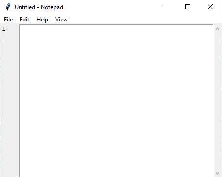
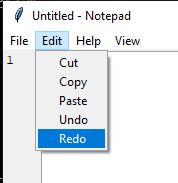
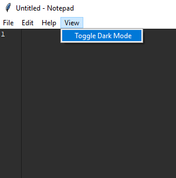

<h1 align="center">NOTEPAD 📓</h1>

<h3 align="center"> &mdash; using PYTHON & TKINTER &mdash;</h3>

&nbsp;
## What is Tkinter?

#### 👉 Tkinter is Python's de-facto standard GUI (Graphical User Interface) package.
#### 👉 Tkinter is not the only GuiProgramming toolkit for Python. It is however the most commonly used one.

&nbsp;
## GUI 🧩

#### A GUI (graphical user interface) is a system of interactive visual components for computer software. A GUI displays objects that convey information, and represent actions that can be taken by the user. The objects change color, size, or visibility when the user interacts with them.

&nbsp;
## WORKING 👷‍♂️

#### ~ After running the program a  GUI window pops out.

#### ~ You can write anything like any normal notepad here.

&nbsp;
### ~ This is the File Menu 👇
 

#### ~ In this window you can create a 'New' file, 'Open' an existing file or 'Save' the current file. You can also Exit the current window.

&nbsp;

### ~ This is the Edit Menu 👇
 

#### ~ In this window you can 'Cut' , 'Copy' ,'Undo' or 'Paste' the content from or into the current file.

&nbsp;

### ~ This is the View Menu 👇
 

#### ~ In this window you can change the mode(dark/light)
## Contributors👨‍💻

<ul>
<li><a href="https://github.com/AshubShafqat">ASHUB SHAFAT</a> (2022-ag-8058)</li>
<li><a href="https://github.com/Hamna902">HAMNA NAZAR</a> (2022-ag-8054)</li>
<li><a href="https://github.com/Aiman990-crypto">AIMAN MISHAL</a> (2022-ag-8072)</li>
<li><a href="https://github.com/mansharamani-rahul">MARYAM SHEHZADI</a> (2022-ag-8063)</li>

</ul>

